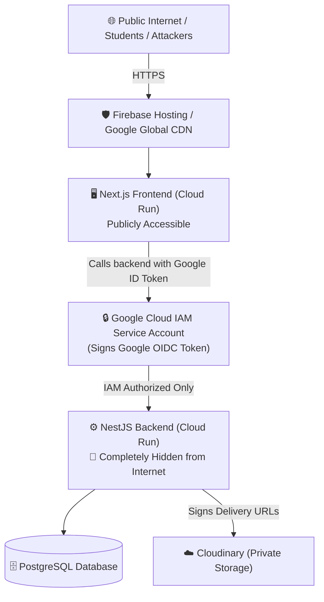

# JSMF Security Architecture & Known Trade-offs

This document details the security architecture of the JSMF platform for V1, highlighting the active defense mechanisms, known trade-offs, and future hardening options (e.g., Cloud Armor, Redis Rate-Limiting, Cloudflare/Turnstile).

---

## 1. Active Security Architecture (The V1 Defense)



### Layer 1: Network & Zero-Trust Boundary
* **Private Backend:** NestJS Cloud Run container does not allow unauthenticated public traffic. Only the Next.js frontend service account (`roles/run.invoker`) can invoke it using Google-signed OpenID Connect (OIDC) identity tokens.
* **No Bypass Route:** The backend cannot be reached except through the frontend. Requests straight to its `.run.app` URL return `403 Forbidden` at Google's edge, so an attacker cannot skip the proxy, hit the API from a spoofed origin, or port-scan the service directly.
* **What this does NOT do — the API is still public.** The frontend proxies `/api/*` to the backend, so every backend endpoint is reachable by anyone over the public domain:

  ```
  https://<domain>/api/catalog/products   -> 200
  https://<domain>/api/health             -> 200
  https://<domain>/api/auth/me            -> 401 (auth working, endpoint reachable)
  ```

  IAM controls *which service* may call the backend. It does not reduce the API's attack surface by one endpoint. Input validation, authorization checks and rate limiting are still the only things standing between a hostile request and the database — the private backend is not a substitute for any of them.

### Layer 2: Authentication & Token Cryptography
* **Asymmetric RS256 JWTs:** Access tokens are signed using an RSA private key held in **Google Secret Manager** and mounted into the backend at runtime — never in the image, the repository, or a plain environment variable. Microservices/guards verify signatures using the Public Key without database lookups.
* **In-Memory Access Tokens:** Access tokens live only in browser memory (a module-level variable, never `localStorage`), so they do not survive a tab close and cannot be read back out of storage.
* **Refresh Tokens Are In `localStorage` — a deliberate trade-off, not an oversight.** Keeping the session alive across reloads requires persisting *something*, and that something is readable by any script running on the page. XSS therefore **can** steal a refresh token and mint access tokens from it. What limits the damage is rotation plus family reuse detection below: the moment the legitimate user refreshes, the stolen token is a replay, and the entire family is revoked. That contains a compromise; it does not prevent one. Moving refresh tokens to an `HttpOnly; Secure; SameSite` cookie is the actual fix and is deferred — see Trade-off 5.
* **Rotating Refresh Tokens:** Refresh tokens (`jsmf.refreshToken`) are single-use and rotate on every exchange.
* **Family ID Reuse Detection:** If an attacker replays a stolen token after it has already rotated, the backend flags `REUSE_DETECTED` and immediately revokes all sessions descended from that login.
* **Argon2id Password Hashing:** Modern memory-hard hashing with opportunistic re-hashing and constant-time dummy hash execution for non-existent accounts to eliminate user-enumeration timing attacks.

### Layer 3: Dynamic Rate Limiting (`IdentityThrottlerGuard`)
* **Authenticated Requests:** Grouped per **User ID** (`RATE_LIMIT_PER_MINUTE`, default 120/min). Students sharing a hostel or college Wi-Fi each get an independent quota — the token's `sub` is the key, so one heavy user cannot lock out everyone behind the same NAT.
* **Anonymous Requests:** Fall back to **Client IP** at the same limit, because before sign-in there is no account to count against.
* **Tokens are verified, never merely decoded.** A JWT payload is readable and writable by anyone holding it, so trusting an unverified `sub` would let a caller invent an identity per request and mint unlimited buckets — strictly worse than counting by IP, which cannot be chosen freely.
* **Global IP Ceiling:** `RATE_LIMIT_IP_CEILING_PER_MINUTE` (default 3,000/min), counted per IP even for signed-in callers. It closes the gap that per-account counting opens: one person holding several accounts would otherwise get an allowance for each. Set where no legitimate shared network reaches, so if it trips, something is wrong.
* **Correctly resolved client IPs.** Behind Firebase Hosting *and* Cloud Run the connecting address is a proxy's, identical for every visitor. `TRUST_PROXY_RANGES` matches proxy addresses rather than counting hops, because the deployment is reachable through two chains of different lengths and a fixed hop count would be wrong — dangerously so — for one of them.

### Layer 4: Entitlements & Storage Security
* **Private Storage:** Paid PDFs are stored as `resource_type: raw`, `type: authenticated`. Public direct URLs return `401 Unauthorized`.
* **HMAC-Signed Download URLs:** Time-limited download links (valid for 5 minutes) are generated only after verifying user entitlements in the database. Extending the expiration parameter invalidates the cryptographic signature.

---

## 2. Known Security Trade-offs & Limitations (V1 Reality)

Every architecture involves trade-offs between **infrastructure cost**, **operational complexity**, and **defense depth**. Here are the known trade-offs in V1:

### Trade-off 1: Public Frontend Exposure
* **The Reality:** While the backend is hidden behind IAM, the **Next.js frontend container is public**.
* **Risk:** An attacker can spam public frontend pages (e.g. `/`, `/browse`) with high-frequency HTTP GET requests.
* **Mitigation in V1:**
  - Prerendered pages are edge-cacheable and are served with `Cache-Control: s-maxage=31536000` (verified live on `/browse`, `X-Nextjs-Cache: HIT`), so a flood against marketing and catalogue pages is largely absorbed before reaching Cloud Run.
  - **`/api/*` is not cached and cannot be** — it is dynamic and proxied straight through. A flood aimed at the API therefore reaches Cloud Run in full, and only the rate limiter stands in front of it. This is the realistic attack, not page GETs.
  - Cloud Run caps run-away compute at `--max-instances` (currently **2** on the backend, 3 on the frontend).
* **Future Hardening:** Add Cloudflare Turnstile / Bot Management or Google Cloud Armor in front of the Next.js entrypoint.

---

### Trade-off 2: In-Memory Rate Limiting vs Multi-Container Drift
* **The Reality:** In V1, rate limits (120 req/min) are tracked **in-memory** on each container instance (`REDIS_ENABLED=false`).
* **Impact:** 
  - Counters are per-instance, so the effective limit is multiplied by the number of running instances. At the backend's current `--max-instances=2` that is up to `2 x 120 = 240` requests/minute before the limit trips; raising `--max-instances` raises this proportionally.
  - The drift is always *upward* — limits become more permissive, never more restrictive — so this degrades protection rather than locking real users out.
* **Why this was chosen:** Avoids paying $15–$35/month for a managed Redis instance during early launch.
* **Future Hardening:** Flip `REDIS_ENABLED=true` and attach a distributed Redis cache (Upstash Serverless Redis or GCP Cloud Memorystore) as traffic scales.

---

### Trade-off 3: Rate Limit Tuning
* **The Reality:** The two global limits are **environment configuration**, not code, because their correct values can only be learned from real traffic. Changing them is a `gcloud run services update --update-env-vars`, not a rebuild and redeploy.
* **Current Configuration:**
  - **Per-caller:** `RATE_LIMIT_PER_MINUTE` (default 120/min) — per account when signed in, per IP when anonymous.
  - **Per-IP ceiling:** `RATE_LIMIT_IP_CEILING_PER_MINUTE` (default 3,000/min).
  - **Boot-time invariant:** the app refuses to start if the ceiling is below the per-caller limit. Inverted, the ceiling would silently become the real limit and put every user on a shared network back into one allowance, while both settings still appeared to work.
  - **Sensitive endpoints** keep tighter per-route decorators in code, because they are security decisions sized to a specific operation rather than capacity knobs: Login 10/min, Refresh 30/min, checkout 20/min, payment verification 30/min, admin invitations 10/hour.
  - **Revenue webhooks:** `@SkipThrottle()` on the Razorpay endpoint, so a burst of genuine payment captures is never dropped. Safe because the HMAC signature already makes unauthenticated flooding pointless.
* **`POST /auth/register`** carries a 5/min decorator and is **enabled** (`PASSWORD_SIGNUP_ENABLED` defaults to `true`), so it is a live control again. It is the tightest limit in the app because registration is what bulk account creation targets, and because the route creates a row and starts a session on every success.

---

### Trade-off 4: Absence of Google Cloud Armor / Dedicated WAF
* **What is Cloud Armor?** Google's enterprise Web Application Firewall (WAF) providing Layer 7 DDoS mitigation, SQL injection (SQLi) filtering, Cross-Site Scripting (XSS) rules, and IP geo-fencing.
* **Why omitted in V1:**
  - Cloud Armor requires an **External Application Load Balancer** ($18–$30/month fixed cost) plus Cloud Armor policy fees ($5–$45/month).
  - For a V1 launch, this adds unnecessary fixed monthly overhead.
* **Protection without Cloud Armor in V1:**
  - Prisma ORM automatically parameterizes all SQL queries (zero risk of SQL injection).
  - Google Cloud Run infrastructure provides built-in Layer 3/4 DDoS protection.
  - NestJS ValidationPipes with `class-validator` strictly strip and reject unwhitelisted request fields.

---

### Trade-off 5: Refresh Tokens in `localStorage` rather than an `HttpOnly` Cookie
* **The Reality:** The refresh token persists in `localStorage`, which is readable by any script executing on the page. An XSS flaw would expose it.
* **Why this was chosen:** It keeps the frontend a pure client of a separately-deployed API with no cookie/CSRF coupling, which is what lets the same identity serve other JSMF applications later.
* **What limits the damage today:** Rotation plus family reuse detection. A stolen token works only until the real user refreshes, at which point the replay is detected and every session in that family is revoked.
* **Future Hardening:** Move refresh tokens to an `HttpOnly; Secure; SameSite=Lax` cookie and add CSRF protection on the refresh route. This removes the token from JavaScript's reach entirely rather than merely containing its theft.

---

### Trade-off 6: The Reconciliation Trigger Is a Second IAM Identity, Not a New Auth Mechanism

* **The Reality:** The reconciliation sweep — the safety net that settles a payment whose webhook never arrived — is now driven by **Cloud Scheduler**, which POSTs `/api/internal/reconcile-payments` every five minutes. The endpoint's own code carries `@Public` (it skips JWT auth) but that is not what protects it: the same `roles/run.invoker` restriction described in Layer 1 applies here too, and Cloud Scheduler is added to it as a second permitted identity alongside the frontend's service account. A request without a valid OIDC token from one of those two service accounts is rejected by Cloud Run itself, before NestJS ever runs — the endpoint has no application-level secret to leak, rotate, or forget to check.
* **The risk:** The blast radius of that service account being misused is small regardless — the sweep only ever *adds* a settlement the provider says is already owed, never removes or grants anything else — but this is now moot rather than a live exposure, since the identity is Google-issued and short-lived rather than a value sitting in an env var.

> **Why this control mattered enough to fix urgently.** In its earlier
> in-process `@Cron` form the sweep fired 8 times in 24 hours instead of ~288,
> and every run failed with `Can't reach database server`: a Cloud Run service
> at `--min-instances=0` has no process for a timer to fire in, and CPU is
> frozen between requests even when one exists. Until it ran, the browser
> callback was effectively the only path granting entitlements — and that path
> is lost if the buyer closes the tab.

---

### Trade-off 7: Google OAuth Unverified App Limit (10,000 Users)
* **The Reality:** Because you are using Google Sign-In for authentication, your Google Cloud OAuth Consent Screen is currently in "Testing" or "Unverified" mode.
* **The Limitation:** Google enforces a strict lifetime cap of **10,000 user grants** for unverified OAuth applications. Once 10,000 unique students sign up, Google will block any new sign-ups.
* **Why this is a V1 Trade-off:** Going through the Google OAuth Verification process requires submitting a YouTube video showing how you use the data, verifying your domain via Google Search Console, and providing links to your Privacy Policy and Terms of Service. This is unnecessary friction for an early launch.
* **Proper fix:** Once the platform is live and approaches a few thousand users, you must go to the GCP Console (APIs & Services > OAuth Consent Screen) and submit the app for verification. Verification is free but takes a few days for Google to review.

---

## 3. Security Hardening Roadmap (When to Upgrade)

| Stage | Trigger / Milestone | Security Enhancement | Est. Cost |
| :--- | :--- | :--- | :--- |
| **V1 (Current)** | Launch; low hundreds of concurrent users | Zero-Trust IAM, RS256 JWTs, per-user throttling, signed URLs | **$0 / month** |
| **V1.5** | Bot spam / Fake accounts | Add **Cloudflare Free Tier** or **Google Cloudflare Turnstile** on Signup/Login | **$0 / month** |
| **V2** | `--max-instances` raised above 1, or rate-limit drift becomes material | Enable **Upstash Redis** (`REDIS_ENABLED=true`) for rate-limit counters shared across instances | **$0 – $10 / month** |
| **V3** | High revenue / Enterprise scale | Deploy **Google Cloud Armor + External HTTP(S) Load Balancer** with OWASP Top 10 rules | **~$35 – $60 / month** |

> **On the V1 capacity figure.** "Low hundreds of concurrent users" is derived
> from configuration, not measured: the backend runs 2 vCPU / 512Mi with
> `--max-instances=2`, and Prisma's default pool is `cores x 2 + 1` — about 5
> connections per instance, so ~10 in total, which every database-touching
> request queues behind. Neon's free tier also suspends compute when idle.
> Registered users are not the constraint; simultaneous in-flight requests are.
> A real number needs a load test against a staging copy, not arithmetic.
