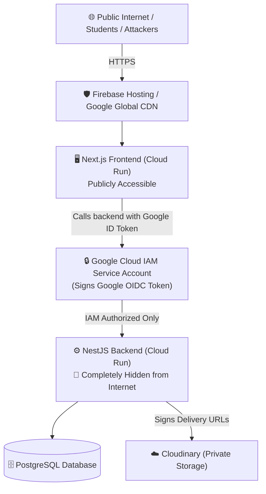

# JSMF Security Architecture & Known Trade-offs

This document details the security architecture of the JSMF platform for V1, highlighting the active defense mechanisms, known trade-offs, and future hardening options (e.g., Cloud Armor, Redis Rate-Limiting, Cloudflare/Turnstile).

---

## 1. Active Security Architecture (The V1 Defense)

### Layer 1: Network & Zero-Trust Boundary
* **Private Backend:** NestJS Cloud Run container does not allow unauthenticated public traffic. Only the Next.js frontend service account (`roles/run.invoker`) can invoke it using Google-signed OpenID Connect (OIDC) identity tokens.
* **Direct Attack Surface Elimination:** Attackers cannot directly port-scan, DDoS, or target backend API vulnerabilities because direct public access returns `403 Forbidden` at Google's edge.

### Layer 2: Authentication & Token Cryptography
* **Asymmetric RS256 JWTs:** Access tokens are signed using an RSA Private Key held exclusively in backend environment variables. Microservices/guards verify signatures using the Public Key without database lookups.
* **In-Memory Access Tokens:** Access tokens live only in client browser RAM (not `localStorage`), eliminating persistent XSS credential theft.
* **Rotating Refresh Tokens:** Refresh tokens (`jsmf.refreshToken`) are single-use and rotate on every exchange.
* **Family ID Reuse Detection:** If an attacker replays a stolen token after it has already rotated, the backend flags `REUSE_DETECTED` and immediately revokes all sessions descended from that login.
* **Argon2id Password Hashing:** Modern memory-hard hashing with opportunistic re-hashing and constant-time dummy hash execution for non-existent accounts to eliminate user-enumeration timing attacks.

### Layer 3: Dynamic Rate Limiting (`IdentityThrottlerGuard`)
* **Authenticated Requests:** Grouped per **User ID** (120 req/min). Students sharing a hostel or college Wi-Fi network each receive independent quotas.
* **Anonymous Requests:** Grouped per **Client IP** (120 req/min) to prevent brute-force attacks on login/registration endpoints.
* **Global IP Ceiling:** An umbrella limit of 3,000 req/min per IP address prevents botnets from registering thousands of fake accounts on a single IP.

### Layer 4: Entitlements & Storage Security
* **Private Storage:** Paid PDFs are stored as `resource_type: raw`, `type: authenticated`. Public direct URLs return `401 Unauthorized`.
* **HMAC-Signed Download URLs:** Time-limited download links (valid for 5 minutes) are generated only after verifying user entitlements in the database. Extending the expiration parameter invalidates the cryptographic signature.

---

## 2. Known Security Trade-offs & Limitations (V1 Reality)

Every architecture involves trade-offs between **infrastructure cost**, **operational complexity**, and **defense depth**. Here are the known trade-offs in V1:

### Trade-off 1: Public Frontend Exposure
* **The Reality:** While the backend is hidden behind IAM, the **Next.js frontend container is public**.
* **Risk:** An attacker can spam public frontend pages (e.g. `/`, `/browse`) with high-frequency HTTP GET requests.
* **Mitigation in V1:**
  - Firebase Hosting / Google CDN caches static assets and SSR responses where appropriate, absorbing basic request floods.
  - Cloud Run auto-scales up to `--max-instances=3`, capping potential compute run-away costs.
* **Future Hardening:** Add Cloudflare Turnstile / Bot Management or Google Cloud Armor in front of the Next.js entrypoint.

---

### Trade-off 2: In-Memory Rate Limiting vs Multi-Container Drift
* **The Reality:** In V1, rate limits (120 req/min) are tracked **in-memory** on each container instance (`REDIS_ENABLED=false`).
* **Impact:** 
  - If Cloud Run scales to 3 instances, requests distributed across instances mean a user could theoretically execute up to $3 \times 120 = 360$ requests/minute before tripping the limit.
* **Why this was chosen:** Avoids paying $15–$35/month for a managed Redis instance during early launch.
* **Future Hardening:** Flip `REDIS_ENABLED=true` and attach a distributed Redis cache (Upstash Serverless Redis or GCP Cloud Memorystore) as traffic scales.

---

### Trade-off 3: Rate Limit Customization & Tuning
* **The Reality:** The baseline 120 requests/minute is configured directly in code within `app.module.ts`.
* **Current Code Configuration:**
  - **Global Baseline:** `limit: 120, ttl: 60_000` (120 req/min in `app.module.ts`)
  - **Hostel IP Ceiling:** `limit: 3_000, ttl: 60_000` (3,000 req/min backstop)
  - **Sensitive Endpoints:** Tighter controller decorators (Registration: 5/min, Login: 10/min, Refresh: 30/min in `auth.controller.ts`)
  - **Revenue Webhooks:** `@SkipThrottle()` on Razorpay endpoints so payment capture notifications are never dropped.
* **Tuning Path:** If needed in the future, these numbers can easily be bound to `env.ts` schema variables or adjusted directly in `app.module.ts`.

---

### Trade-off 4: Absence of Google Cloud Armor / Dedicated WAF
* **What is Cloud Armor?** Google's enterprise Web Application Firewall (WAF) providing Layer 7 DDoS mitigation, SQL injection (SQLi) filtering, Cross-Site Scripting (XSS) rules, and IP geo-fencing.
* **Why omitted in V1:**
  - Cloud Armor requires an **External Application Load Balancer** ($18–$30/month fixed cost) plus Cloud Armor policy fees ($5–$45/month).
  - For a V1 launch, this adds unnecessary fixed monthly overhead.
* **Protection without Cloud Armor in V1:**
  - Prisma ORM automatically parameterizes all SQL queries (zero risk of SQL injection).
  - Google Cloud Run infrastructure provides built-in Layer 3/4 DDoS protection.
  - NestJS ValidationPipes with `class-validator` strictly strip and reject unwhitelisted request fields.

---

## 3. Security Hardening Roadmap (When to Upgrade)

| Stage | Trigger / Milestone | Security Enhancement | Est. Cost |
| :--- | :--- | :--- | :--- |
| **V1 (Current)** | Launch to 10,000 users | Zero-Trust IAM, RS256 JWTs, In-Memory Throttler, Signed URLs | **$0 / month** |
| **V1.5** | Bot spam / Fake accounts | Add **Cloudflare Free Tier** or **Google Cloudflare Turnstile** on Signup/Login | **$0 / month** |
| **V2** | Multiple Cloud Run instances (>5) | Enable **Upstash Redis** (`REDIS_ENABLED=true`) for centralized rate-limiting | **$0 – $10 / month** |
| **V3** | High revenue / Enterprise scale | Deploy **Google Cloud Armor + External HTTP(S) Load Balancer** with OWASP Top 10 rules | **~$35 – $60 / month** |
